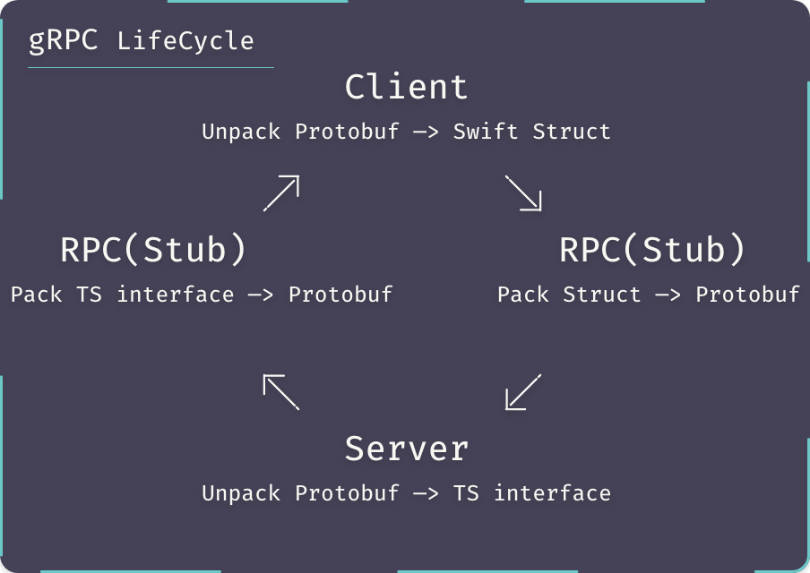
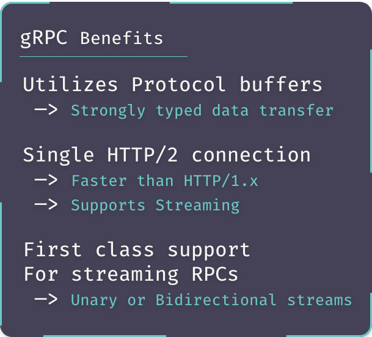

# gRPC in TypeScript


## Overview






### Setting-Up Environment

#### VSCode Extension

- vscode-proto3

> Protobuf 3 Syntax highlighting (i.e .proto files)

#### Creating the .proto file

> create an empty welcomer.proto file, and type in the following:

```protobuf
// welcomer.proto
syntax = "proto3";

package welcomer;

service Welcomer {
  rpc welcome (InputRequest) returns (OutputResponse);
}

message InputRequest {
  string name = 1;
}

message OutputResponse {
  string message = 1;
}
```

#### Dependencies

> within the terminal at root directory type the following:

```bash
yarn init -y
```

> with our package.json file initialized we can install dependencies as follows:

- google-protobuf

> JavaScript Protocol Buffers runtime library (i.e run .proto files)

- grpc

> gRPC for Node.js Library.

- grpc-tools

> gRPC code generation for JavaScript

- grpc_tools_node_protoc_ts

> TypeScript Type Definitions based on generated JS (i.e .d.ts files)

```bash
yarn add google-protobuf grpc

# Development Dependencies
yarn add -D grpc-tools grpc_tools_node_protoc_ts
```

#### TypeScript

> TypeScript compiler library

```bash
yarn add -D typescript
```

- @types definitions

> Dependency Library type definitions to help with development

```bash
yarn add -D @types/node @types/google-protobuf
```

- tsconfig.json file

> In order to generate the TS configuration file type the following within the terminal:

```bash
npx tsc --init
```

> Copy the following into the newly generated tsconfig.json file

```json
# tsconfig.json
{
  "compilerOptions": {
    "outDir": "./dist/",
    "module": "commonjs",
    "noImplicitAny": true,
    "allowJs": true,
    "esModuleInterop": true,
    "target": "es6",
    "sourceMap": true
  },
  "include": ["./src/**/*"],
  "exclude": ["node_modules"]
}
```

#### Generating Code and TypeScript Definitions

When generating JavaScript code for Node.js gRPC, we would simply need to use the following command within our terminal as follows:

```bash
protoc -I=./proto/welcomer.proto \
  --js_out=import_style=commonjs,binary:./server \
  --grpc_out=./server \
  --plugin=protoc-gen-grpc='which grpc_tools_node_protoc_plugin'
```

However, with TypeScript this quickly gets confusing and easily frustrating,
especially for typo prone individuals such as myself, therefore,
I use a bash script in order to have a single source to debug if issues do arise.

> Create a scripts/ folder and within a new gen_protoc.sh file, and type the following within:

```bash
# gen_protoc.sh
#!/usr/bin/env bash

BASEDIR=$(dirname "$0")
cd "${BASEDIR}"/../

PROTOC_GEN_TS_PATH="./node_modules/.bin/protoc-gen-ts"
GRPC_TOOLS_NODE_PROTOC_PLUGIN="./node_modules/.bin/grpc_tools_node_protoc_plugin"
GRPC_TOOLS_NODE_PROTOC="./node_modules/.bin/grpc_tools_node_protoc"

for f in ./src/proto/*; do
    if [ "$(basename "$f")" == "index.ts" ]; then
    continue
    fi

${GRPC_TOOLS_NODE_PROTOC} \
    --js_out=import_style=commonjs,binary:"${f}" \
    --grpc_out="${f}" \
    --plugin=protoc-gen-grpc="${GRPC_TOOLS_NODE_PROTOC_PLUGIN}" \
    -I "${f}" \
    "${f}"/*.proto

${GRPC_TOOLS_NODE_PROTOC} \
    --plugin=protoc-gen-ts="${PROTOC_GEN_TS_PATH}" \
    --ts_out="${f}" \
    -I "${f}" \
    "${f}"/*.proto

done
```

> In general there are a couple of ways to run script files,
> In my personal opinion the best way would be to simply use the bash command within the terminal
> instead of changing the permissions of a script file with chmod prior to executing the script,
> However, I will show both ways and leave you to be the judge of which is better for you

- bash command

> from root directory, within the terminal simply type the following:

```bash
bash ./scripts/gen_protoc.sh
```

> The above will execute the script file and generate code files with .d.ts definitions

- chmod command

> from root directory, within the terminal type the following

```bash
sudo chmod +x ./scripts/gen_protoc.sh
```

> The above will make our script executable, in order to execute it we will need to type the following:

```bash
./scripts/gen_protoc.sh
```

- package.json scripts

> no matter the choice you take for executing the bash script, in order to make life simpler, lets create a script entry within our package.json file to run our script ease pease.

```json
# package.json
{
  "scripts": {
    "build": "npx tsc --skipLibCheck",
    "prod": "npx tsc --skipLibCheck && node ./dist/server/server.js",
    "dev": "ts-node src/server/server.ts",
    "gen:proto": "bash ./scripts/gen_protoc.sh"
  },
```

> NOTE: make sure to use the right command to the execute the script
>
> - bash command
>
> ```json
> "gen:proto": "bash ./scripts/gen_protoc.sh"
> ```
>
> - chmod command
>
> ```json
> "gen:proto": "./scripts/gen_protoc.sh"
> ```

#### File Structure

lets finish up our setup by creating the necessary files and folders as follows:

|── ./dist/
|
├── ./node_modules/
|
├── ./scripts/
| |
│ └── ../gen_protoc.sh
|
├── ./src/
| |
| ├── ../handler/
| | |
| | └── ../../welcomer.ts
| |
| ├── ../proto/
| | |
| | ├── ../../welcomer/
| | | |
| | | └── ../../../welcomer.proto
| | |
| | └── ../../index.ts
| |
| └── ../server/
| |
| └── ../../server.ts
|
├── ./package.json
|
├── ./tsconfig.json
|
└── ./yarn.lock

> We are left to write the code for both the server.ts file, as well, as the welcomer.ts handler file as follows:

```ts
// welcomer.ts
import * as grpc from 'grpc';

import { InputRequest, OutputResponse } from '../proto/welcomer/welcomer_pb';
import { WelcomerService, IWelcomerServer } from '../proto/welcomer/welcomer_grpc_pb';

class WelcomerHandler implements IWelcomerServer {
  /**
   * Greeting Service
   * @param call
   * @param callback
   */
  sayHello = (call: grpc.ServerUnaryCall<InputRequest>, callback: grpc.sendUnaryData<OutputResponse>): void => {
    const reply: OutputResponse = new InputRequest();
    reply.setMessage(`Hello, ${call.request.getName()}`);
    callback(null, reply);
  };
}

export default {
  service: WelcomerService,
  handler: new WelcomerHandler(),
};
```

> finally we can create our gRPC server as follows:

```ts
import * as grpc from 'grpc';

import { protoIndex } from '../proto';
import welcomerHandler from '../handlers/welcomer';

protoIndex();

const port = 12345;
const host = '0.0.0.0';

type StartServerType = () => void;
export const startServer: StartServerType = (): void => {
  const server: grpc.Server = new grpc.Server();
  server.addService(welcomerHandler.service, welcomerHandler.handler);
  server.bindAsync(`${host}:${port}`, grpc.ServerCredentials.createInsecure(), (err: Error, port: number) => {
    if (err != null) {
      return console.error(err);
    }
    console.log(`gRPC listening on ${port}`);
  });
  server.start();
};

startServer();
```
